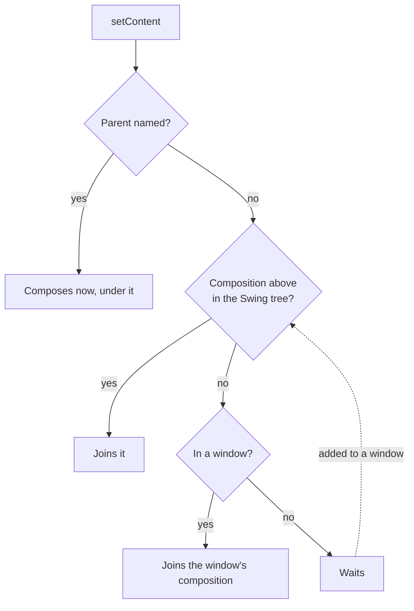
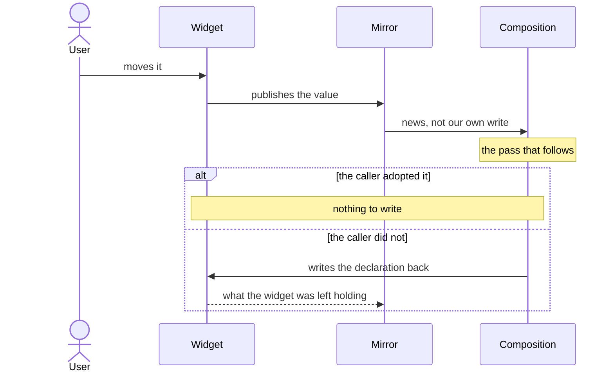
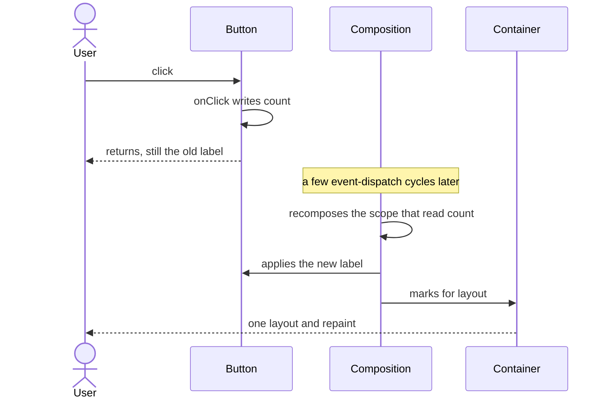

# Architecture

Compose Swing UI is a Compose-runtime binding over Swing. Layout, measurement, and painting stay
with Swing: your composition produces real `java.awt.Component`s, sized and placed by Swing's layout
pass and painted by the look-and-feel. What the library adds is Compose's composition model -
composition and recomposition, snapshot state, effects, and a frame clock - driving a live AWT
component tree on the Event Dispatch Thread (EDT).

This document describes the concepts that shape the binding. The KDoc on the public API is the
reference for individual functions.

---

## Mounting a composition

A composition is mounted onto an existing Swing container with `container.setContent { ... }`.
There are matching entry points for windows and for menu bars, and a high-level `application`
entry point that owns a whole app lifecycle.



Mounting always happens on the EDT, because composition and the AWT mutations it drives must run
on that thread. A mount looks for a composition already hosted above it in the Swing tree, starting
with the container itself, and joins that one, sharing its scope and `CompositionLocal`s. Failing
that, it joins the composition scope belonging to its window. Every mount nests into something, so
two containers given content under one window recompose together, on that window's recomposer and
its frame clock. A container that is in no window yet is mounted the moment it is added to one.

A mount can also be given the composition it nests into. A composable scope hands one over with
`rememberCompositionContext()`, and `component.findRecomposer()` reads the scope already driving
composed content - a `Recomposer` is a `CompositionContext`, so it stands as a parent as it is.
`container.setContent(parent) { ... }` then composes on the call, whatever the container is attached
to. Everything mounted inside such a container joins the same parent: a
`setContent` naming no parent of its own on a container hanging under that content composition resolves
to the composition it was given rather than to the window's. A container given a window's own scope
joins the composition of the window it is in should it later be added to another, so a window's
content still recomposes on one recomposer and one frame clock. A container given a runtime of its
own is kept on that runtime instead: a move brings only the window its content reads up to date.

Content reads a `LifecycleOwner` through `LocalLifecycleOwner`, shared by everything that content
hosts - popups, menus, overlays. A mount takes the owner of the mount above it in the Swing tree, and
only where there is none does it get an owner of its own. A `Window` or `Dialog` composed in it always
gets one of its own, since being attached, minimized or focused are facts about a single window. An
owner answers for the content it follows, so a mount that resolved one reports where that content
stands rather than where its own container hangs, and disposing that mount leaves the owner live -
only the mount an owner was made for ends it. Attachment
to the Swing tree, minimization of the window, and that window's keyboard focus move an owner between
`CREATED`, `STARTED`, and `RESUMED`; the KDoc on `setContent` is the reference for which is which.

Mounting returns a handle. Disposing it tears that content down.

---

## Driving recomposition

A root composition recomposes on the EDT, so recomposition and the AWT changes that follow it
share the one thread Swing allows for component work. Inside effects and frame callbacks you can
therefore read and write both Compose state and Swing components directly, without hopping threads.

When snapshot state is written - from an effect, a coroutine, a background thread, or a Swing
listener callback - the change is observed at the level of the composition that owns the affected
nodes, and the scopes that read the changed state are scheduled to recompose. Reading and
writing snapshot state (`mutableStateOf`, `derivedStateOf`, `snapshotFlow`, `produceState`, and the
rest) behaves as it does on any Compose target.

---

## Two cadences: changes and animation time

A change and the passage of animation time advance at rates of their own.

A change follows the event queue. The pass that recomposes and applies it is dispatched as an event of
its own, so a declared change reaches its widget a handful of event-dispatch cycles after the event
that made it rather than at the next tick of a frame cadence. It costs one pass per event rather than
one per write: the pass is dispatched only
once the Swing event that made the writes has returned, so a listener writing ten properties still
costs a single pass.

That is not a setter. A setter is on its widget for the very next statement; a declared write is never
visible inside the event that made it, and code that has to see the result waits for a later cycle.

A widget the user can change themselves follows a cadence of its own, because the composition and the
user both write it. *Settling a value the user can also change*, below, is where that one is described.

`withFrameNanos`, and the animation APIs built on it, advance at a nominal cadence instead. Content
mounted under a window takes that cadence from the display the window is on and follows it across
displays; a composition standing in no window keeps a fixed nominal rate. The cadence is best-effort
wall-clock timing rather than vsync, and it runs only while something is awaiting a frame, so an idle
window does no per-frame work while an animating one advances a step at a time. A change landing
mid-animation does not wait for the animation's next frame, and leaves the animation exactly where it
was, so the animation neither skips a step nor takes an extra one. Time-based work in separate
windows is independent.

---

## Applying changes to the AWT tree

As a composition changes, the runtime emits structural operations - insert, remove, move, clear -
that are applied to the backing container. Child order in the AWT tree is kept aligned with
composition order, so index-based operations always address the intended component.

Swing does not lay out or repaint added, removed, or moved children on its own: a mutated container
needs an explicit layout-and-repaint pass to make the change visible. Every container touched
during a change pass therefore gets one such pass once the pass completes, so a change that touches
a container many times still costs a single layout. The menu tree follows the same model through
its own applier.

Changing a *property* of a component that is already attached takes a different route: a component's
`update` block declares one value per property it drives, and a declaration reaches the widget on the
first composition, on any later pass where it differs from the one applied last, and in full again on
the fresh component a reactivated node's factory builds, since that component starts from nothing and
needs every declared property regardless of which of them changed. Recomposition with unchanged state
therefore writes nothing to an already-attached widget, and the frame costs neither a Swing property
write nor the layout or repaint one would trigger. See
[`CUSTOM-COMPONENTS.md`](CUSTOM-COMPONENTS.md) for writing such a block.

---

## Inspecting a mounted composition

Setting `isDebugInspectorInfoEnabled` to `true` makes every composition record where it declared each
component, including the compositions already on screen. `Component.findDeclaringGroup()` then answers
with the group that declared a component, and `Component.attachComposeStackTrace()` names the code
that declared it. See [`INSPECTING-COMPOSITIONS.md`](INSPECTING-COMPOSITIONS.md) for the switch, what
it costs, and how to be told as compositions start and end.

---

## Placing children with explicit constraints

Some layouts need to know *where* a child belongs - a `BorderLayout` needs a region (`NORTH`,
`CENTER`, ...), and other constraint-based layouts need their own constraint objects. Composition
order does not express that intent: conditionals and reordering change a child's index without
changing where the author meant to place it. Placement is therefore explicit rather than inferred
from index.

A child declares its own placement, on its own modifier. `layoutConstraint` puts the whole constraint
on the modifier outright, and the last one declared there wins. A `Row` or `Column` scope's own
builders - `weight()`, `align()`, a cross-axis fill - each declare a part of the constraint instead
and fold it into what the modifier declared before. A modifier mixing the two kinds of declaration is
refused. The default, for a modifier that declares neither, is "add by position," and a modifier that
stops declaring a placement returns the component to it.

The ordering that makes this work is the applier's own. An inserted node is visited twice, top-down
and then bottom-up, its `update` changes run between the two passes, and the bottom-up pass is the
one that performs the Swing attachment. A placement written by that node's own `update` is therefore
already on the node by the time the child is added to its parent, so the child arrives in the region
it declares rather than being added and then moved there.

A container supplies the layout manager and a scope naming the placements that manager understands.
A `PanelLayout.Border` panel is the canonical one: its regions are modifier builders declared on
`BorderPanelScope`, callable only inside that panel's content, each appending the `BorderLayout`
constraint it names. Emitting a child adds it in the region it declares, dropping the child removes
it, and declaring a different region moves it. A child that declares no region is a center child. The
same mechanism extends to other constraint-based layouts, and to hosts whose children are installed
through dedicated setters (such as a scroll pane's viewport, headers, and corners) rather than a
generic add.

`layoutConstraint` is public, which is what makes a container over a layout manager the library does
not model possible at all: the container supplies the manager and hosts arbitrary content, and each
child it holds names its own place in it. The value is untyped, matching what a container takes; a
manager's author names it in a scope of typed builders for their own callers.

A placement reaches the node whose modifier declares it and travels no further, so it says nothing
about that node's own children: a container placed in a region of its parent lays its own children
out under the placements they declare, and neither knows about the other.

A constraint that changes while its component is already attached re-registers the component with its
parent's manager rather than re-adding it, so placement follows state without the component losing
its position in the container, its focus, or its native resources.

The two kinds of placement differ in when a change takes hold. A layout constraint is the parent's
layout manager's, and the manager can be told about it at any time, so a new value takes effect as it
changes. A host-slot attachment is the applier's, and it is identified by the region's name alone: a
modifier naming a different region moves the child there within the same change pass. The applier
compares names, not attachments, so declaring a different attachment under a name that stays the same
moves and reinstalls nothing, and a container
that wants to change what an already-filled region shows for its child writes that as an ordinary
property on the node, the way a tab's title is.

---

## The node lifecycle and listeners

Each node in a composition wraps a Swing component. When content is conditionally shown and hidden - a
`ReusableContentHost` deactivated and reactivated, say - the node parks: its component detaches from
the Swing tree, and reactivation builds a fresh component from the node's own factory rather than
reusing the parked one.

This node lifecycle is why listener lifecycle matters. A listener that calls back into composition
state must be attached for exactly the node's current lifetime: it is detached when the node is
released or deactivated, so it never fires into a composition that has moved on. Listeners the host
application attaches directly to a component are never touched.

Listeners are exposed through the modifier system, where the form a caller declares selects the
mechanism. A raw listener is registered by identity, so a fresh instance each recomposition detaches
the old one and attaches the new. A lambda is read when the event fires, so the library builds the
listener once and a fresh lambda re-registers nothing.

---

## Styling and configuration with modifiers

`SwingModifier` is the Compose-shaped way to configure a component: appearance, layout hints,
keyboard and interaction wiring, data transfer, accessibility, and listeners are expressed as
modifier elements declared on a component. A passed `modifier` is the base, and a component's own
elements are added onto it, following the Compose convention. Elements that share a slot are
last-wins, so where a component declares a property itself, its own value stands - what a component
means you to decide is a parameter, not a modifier element.

A modifier is immutable and diffed against the one applied last. One declaring what that one
declared is skipped whole, and within a modifier chain that did change every element is compared on its
own, so a property whose declared value has not changed is not written again. Once an earlier
declaration writes, the modifier's order decides which declaration stands. A value compares
structurally. A callback the node reads when an event fires is not a value the node holds, so it is
no part of what its element declares: a modifier the composition rebuilt around a fresh callback
still declares the registration it declared last, the callback reaches the already-installed
listener on its own, and the modifier is skipped around it. Building the modifier inline in the
composable body is therefore the intended style and needs no `remember`; hoisting one is for sharing
it as a theme token, not for making it cheap.

Closed sets of Swing integer (and a few string) constants - scrollbar policies, orientations,
selection modes, and the like - are exposed as typed constant sets. A parameter that takes one of
these accepts exactly the values the wrapped Swing API expects, so an unintended value is flagged
in the IDE while the value passed at runtime is the plain Swing constant.

Where an element takes over behavior a widget already has, it takes over only what it declares. Data
transfer is the clearest case: a component's export and its import are separate. Declaring `draggable`
or `clipboard` decides what the component exports; declaring `dropTarget` or `clipboard` decides what
it imports, and every drop and paste that reaches it. Whichever direction is left undeclared is left
to the component, so a widget that ships an import of its own - a text component's paste - still
performs it beside a declared export, and the actions a source offers stay the ones it offers on its
own beside a declared import. Removing the last such element restores the component's own behavior.

---

## Effects and snapshot state

Prefer the snapshot APIs over hand-wiring Swing listeners to state when you want derived or
asynchronously produced values to stay in sync.

---

## Reading state outside a composable

Not everything that follows snapshot state is a composable scope. Painting is not, and neither is
pushing a window's geometry onto a real window: both happen after the composition has already decided
what to emit, and re-running the whole scope to redo them would be the wrong unit. For those the
binding records the reads against the block itself. A change to state the block read re-runs that
block - a repaint, a re-apply - and recomposes nothing.

`Canvas` is the component in the library that works this way: state the drawing lambda reads at paint
time is tracked, and a later change repaints that one surface and re-invokes the same lambda with the
new values. On the same terms as a listener, a component's tracked reads are dropped when its node is
released or deactivated, so a parked node reacts to nothing; the fresh component a reactivated node's
factory builds registers its own reads the next time it paints.

A window's geometry is observed separately: a snapshot's apply notification arrives on whichever
thread applied the snapshot, while sizing, packing and placing a window is the EDT's alone, so that
notification is handed to the EDT before the geometry is re-applied. Reading the declared geometry
there rather than in a composable body is what keeps a drag or a resize off the composition entirely:
the window system reports the gesture once per frame, each report is written back into the very state
the window is declared with, and each write re-runs an apply that finds the window already standing as
the state says.

---

## Shapes for state the user can change

Part of what a component holds, the user changes themselves: a scroll position, a selection, the order
of a table's columns, which component holds the keyboard. Three shapes carry that, and what the state
is decides which one a component uses.

- **A declared value with a change callback** is the ordinary shape. The composition holds the value
  and passes it in, and the component reports the user's change back through a callback beside it - a
  text field's `value` and `onValueChange`, a table's `selectedRowIndices` and `onSelectionChange`, its
  `columnLayout` and `onColumnLayoutChange`. A change the caller does not answer with a matching value
  is settled back onto the declared one, so the state the composition holds is what is on screen, and
  the component never stands on a value the caller has not adopted. A value the composition pushes in
  is not reported back through the callback, so adopting a reported change cannot loop. Where declaring
  is optional the value is nullable: leaving it out leaves that aspect to the widget, while the
  callback still reports what the user did with it.

- **A hoistable state holder** - an `XState` type with a matching `rememberXState` factory - carries
  state that is a group of related values rather than one, that includes values the component reports
  and no caller declares, or that has to outlive the content it belongs to. A scroll position comes with
  the viewport metrics that bound it and the largest position worth scrolling to; an internal frame's
  geometry comes with whether it stands on the desktop as its icon; a window's placement comes with its
  extended state. The properties a caller can declare are two-way: assigning to one drives the live
  component, and the user's own action writes the new value back into the holder, where whatever reads
  it recomposes. A value only the component can report is read-only and follows the live component the
  same way; reading it is the only way to see that value, since no callback reports it. A holder is
  passed in as a parameter, beside or in place of the plain declared value, so a caller hoists one only
  where they want what it observes.

- **An imperative handle** carries an interaction that is an event and leaves no value behind. A
  `FocusRequester` moves the keyboard when the application decides to - a validation failure, a
  toolbar action, a shortcut - and a `ClipboardHandle` copies, cuts or pastes when a menu item asks,
  without the user pressing the shortcut. A request that has happened leaves nothing for a
  later recomposition to re-apply, so instead of a declared value it is a handle the caller holds,
  calls, and binds to a component with a modifier. A handle names the component it drives, so what it
  can do is what that component can do. Where a component already hands out a state holder, its
  gestures ride on that holder instead of on a handle of their own: a `ListState` reveals a row of its
  list and a `TreeState` a node of its tree, a `ScrollState` reveals a region of the content it
  scrolls, and a `FormattedValueState` commits an edit the user typed but never entered.

For how a component of your own takes a value in and reports a change out, see
[`COMPONENT-STATE.md`](COMPONENT-STATE.md).

---

## Settling a value the user can also change

The first of those shapes needs a mechanism the other two do not. A declared value with a callback has
two writers - the composition and the user - and a component has to reconcile them without either one
winning by accident.

The component keeps a mirror of what its widget currently holds. The widget's listener feeds every value
it publishes into the mirror, and the mirror answers whether that value is news: a change the user made,
rather than one the wrapper's own write to the widget just produced. Settling then compares what the
composition declares against what the widget reads back as, and writes the declaration back wherever the
widget has drifted from it.



**Settling runs in a pass, not at the moment of the change.** The value to settle against is the
declaration, and the declaration only exists while a pass is running. So a change is recorded when it
happens and answered on the pass that follows.

That pass has to arrive before the user sees the change. Swing asks for a repaint from inside the setter
that writes the widget, and the event serving it is queued ahead of anything the report of that change
can schedule, so a pass that costs an event of its own is always a frame too late: the rejected value is
painted, and the declaration arrives for the paint after it.

**A discrete interaction settles before the repaint it provokes is served.** Once the caller has been
told of the change and has had its chance to adopt it, the component asks its composition for a frame -
publish the writes, drain the resumed work, run the pass - and where nothing has queued one already that
frame runs there and then, inside the event that made the change. This is the same body the scheduled
path
runs, so there is no second path to keep correct, and it holds back while a frame is already running,
while anything awaits a frame, and while one is already queued for the event being dispatched, leaving
those cases to the path that queued it.

**Every frame publishes the writes made since it was queued, before it broadcasts.** Publishing belongs
to the frame rather than to whoever asked for one: a queued frame runs after whatever writes the events
between the request and the frame made, and one that broadcast without publishing them would recompose
against a value already superseded - leaving the widget holding a change the composition has answered,
for
the paint that follows to show.

What a node reaches for that frame is the owner its applier attached to it as it inserted it - one
object per composition, holding the snapshot observer its components register with, the batch its
updates are held in, and the call that runs that frame. A node applies the owner to the mirrors it
settles as it is created, through `applyMirror`, so a wrapper's listener has one to ask. The owner holds
the composition context it was mounted under and reads the runtime out of the coroutine context that
states it, so nothing walks the Swing tree for it. It reads it on each change it settles rather than
keeping a reference of its own, because one runtime serves several compositions.

A change no wrapper reports that way is settled by the runtime instead, without the wrapper naming a
frame at all. A component hands its event to the toolkit's listeners before it processes that event
itself, and the repaint the change provokes is asked for during the processing. So a frame queued from a
toolkit listener is queued ahead of that repaint: the runtime listens for the events a declared value
changes on - key, mouse, motion, input method, and the focus loss a formatted field commits its text on -
and queues one frame per event, which settles the declaration before the paint the change asked for is
served. That is what covers a text edit, a formatted commit, and an option inside a group,
none of which can settle from their own report. A frame queued from the report of a change instead is
behind the repaint by construction, however early it is queued, which is why a report cannot carry it.

The two do not make one another redundant. A report settles without queueing a frame at all, and settles
a change the runtime is handed no event for.

A continuous gesture is covered too: motion is in that mask, and a drag step costs no pass the recomposer
was not already going to run, only a frame queued where one is not queued already. What keeps the
scheduled path is a change the runtime is handed no event for - a write from a timer, a drop, a caller
reaching the widget directly. There the pass follows within a few event-dispatch cycles, which bounds
how long the rejected value shows without guaranteeing it never shows.

What schedules that pass is the mirror itself. Reading the mirror while composing subscribes the reading
scope to the widget changing, the same way any other state read does. A change the caller adopts would
bring a pass anyway, through the state the caller adopted it into; a change the caller does not adopt
touches no state anywhere, so without the mirror nothing would schedule the pass that puts the declaration back. A
component that needs the news without the value subscribes explicitly, rather than reading a value it
throws away.

One kind of change is not news: the one a settle made and then read the widget's answer to. That change
is where the declaration was already heading, and the pass that made it has already been told where it
landed. Carrying it back would schedule a pass to answer a change that has been answered - a wasted frame
after every settle.

This is also why a widget settles in a pass while a window's geometry, described above, settles without
one. A window is declared with observable state that the window system's own reports are written back
into, so re-applying that declaration is idempotent and can run straight from an observer. A widget is
declared with a value and a callback, and that value exists only while the pass that declared it runs.

---

## A state change, end to end

Consider a button whose label reflects a counter:

```kotlin
var count by remember { mutableStateOf(0) }
Button(text = "Clicks: $count", onClick = { count++ })
```



1. The user clicks. Swing fires the button's listener on the EDT and the current `onClick` runs
   `count++`.
2. Writing the state is observed and the scope that read `count` is scheduled to recompose. The
   listener returns with the button still showing the old label.
3. A handful of event-dispatch cycles later the invalidated scope re-executes and recomputes the
   label; the stable listener is left in place.
4. The change is applied to the live button, and its container is marked for layout.
5. Once the change pass completes, that container is laid out and repainted once, and the new label
   is on screen.

If a child had appeared or disappeared instead - a conditional inside a `PanelLayout.Border` panel -
the applied change would be an insert or remove in the region that child declares, and the
layout-and-repaint pass is what makes the structural change visible.

---

## Naming what a change costs

The pipeline names its own stretches, so a profiler can attribute a declared change rather than
leaving it as one undifferentiated block of Swing time. Every section is opened under the trace category
`org.jetbrains.compose.swing`:

| Section  | Covers                                                                                 |
|----------|----------------------------------------------------------------------------------------|
| `frame`  | one frame whole: the recomposition and the changes it applies                          |
| `apply`  | one change pass, from the first change to the last container brought up to date         |
| `insert` | one node taken into the tree                                                           |
| `attach` | one node given its place in a container                                                |
| `remove` | children taken out of a container                                                      |
| `move`   | children reordered within a container                                                  |
| `settle` | one mirror settling: a write to a widget property the user can also change, and the read-back that records what the widget was left holding |

All five nest inside `apply`: the four node sections name each kind of churn the applier drives, and
`settle` names a wrapper's own write and read-back. Nothing finer: the composition already names
every restartable composable, and a section per widget would cost more than it reports.

`apply` deliberately covers the pass as a whole rather than its tail. The node update blocks - where
each widget is written - run before the applier's final flush, so a section around the flush alone would
report the change phase as a fraction of a percent of a frame when it is closer to a third. Both the
component and the menu applier open it, so a menu composition's pass is named as well.

Sections go through `androidx.tracing`'s `Tracer`. The library installs nothing: it reports to whoever
installs a tracer, and to nobody otherwise. A build that traces adds `androidx.tracing:tracing` itself
and installs a `Tracer` before the first composition is mounted.

Those are not the only sections a recording can carry. The Compose compiler already writes a marker
around every restartable composable, and those markers reach whatever `CompositionTracer` is
installed through `Composer.setTracer`, which is internal Compose runtime API a tool opts in to.
Install one alongside a `Tracer` and a single recording carries the frame and the change pass with
the composables that ran inside them.

---

## Why Swing needs an explicit applier

The same Compose runtime drives very different targets, and the differences concentrate in how
changes reach the screen:

| Concern                | Swing (this library)                                                             | Compose Multiplatform                                                             | DOM (Compose HTML)                                  | Terminal (Mosaic)                             |
|------------------------|----------------------------------------------------------------------------------|-----------------------------------------------------------------------------------|-----------------------------------------------------|-----------------------------------------------|
| Backing tree           | `java.awt.Container` widgets                                                     | `LayoutNode`s, a tree the toolkit owns outright                                   | live DOM nodes                                      | an in-memory node tree                        |
| Who lays out           | Swing `LayoutManager`s                                                           | Compose UI's own measure-and-layout pass                                          | the browser's reflow engine                         | the target's own layout pass                  |
| Making changes visible | an explicit layout-and-repaint pass per touched container                        | the owner is told changes ended, and the next frame draws the scene onto a canvas | mutating the DOM reflows and repaints automatically | the target re-runs layout and renders a frame |
| Placement              | explicit constraints, because layout managers need region/constraint information | `Modifier` and layout composables                                                 | CSS and element order                               | the target's own modifier/layout system       |
| Threading              | the EDT                                                                          | a frame-driven render loop, on the EDT where the desktop target hosts it          | the single-threaded JS event loop                   | the target's render loop                      |

Swing reflows neither on mutation, the way the DOM does, nor on its own schedule, the way a target
that owns its render loop does. That is the fact the binding is built around.

Compose Multiplatform is the closest comparison: on the desktop it runs on the very same thread this
library does and still needs an applier of its own, because it owns its node tree, its layout pass and
its drawing, while here all three belong to Swing.

---

For a step-by-step guide to building your own component on top of `SwingNode`, see
[`CUSTOM-COMPONENTS.md`](CUSTOM-COMPONENTS.md).
