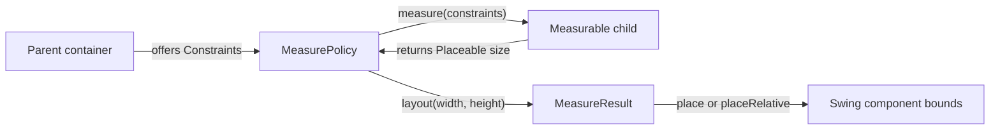
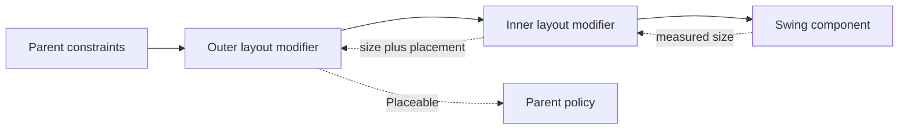

# Foundation Layout

Compose Swing UI's foundation layout API adapts the parent-driven measurement model and familiar
surface of the Jetpack Compose and Compose Multiplatform Foundation Layout module
(`androidx.compose.foundation.layout`) to real Swing components. A parent offers constraints, a child
reports a size, and the parent places it. Swing still owns the component tree, layout lifecycle, and
final bounds.

See [`CUSTOM-CONTAINERS.md`](CUSTOM-CONTAINERS.md) to implement a container and
[`ARCHITECTURE.md`](ARCHITECTURE.md) for the runtime.

## Layout at a glance

A layout pass has three steps:

1. The parent measures each child under `Constraints` that it chooses.
2. The parent chooses its own size from the measured children and its incoming constraints.
3. The parent places each measured child inside its own inner rectangle.



This is the same parent-measures-child model used by Compose UI. Compose Swing UI adapts it to Swing's
`LayoutManager2` lifecycle and runs it on the Swing Event Dispatch Thread (EDT).

## Constraints

`Constraints` gives the minimum and maximum width and height that a child may occupy. An axis is:

- bounded when its maximum is finite;
- unbounded when its maximum is `Int.MAX_VALUE`; and
- exact when its minimum and maximum are equal. An exact axis is bounded.

Minimum values must be non-negative and cannot exceed their matching maximum. `Constraints.Unbounded`
uses zero minimums and unbounded maximums.

The values use the same integer user-space coordinates as AWT geometry. They are not `Dp` values and
need no density conversion. AWT's graphics transform maps user-space coordinates to device pixels.

## Measurement and placement

A `MeasurePolicy` receives the container's children in declaration order as `Measurable` objects. It
measures each child, decides the container's size, and returns a `MeasureResult` with a placement
block:

```kotlin
layout(width, height) {
    first.placeRelative(0, 0)
    second.placeRelative(first.width, 0)
}
```

<!--- CLEAR -->

`Measurable.measure(constraints)` returns a `Placeable` with the measured `width` and `height`. A later
measurement of the same child overwrites that object. Place only its final measurement, and do not
retain it across another measurement.

The placement block runs inside the container's inner rectangle, after its insets:

- `place(x, y)` measures `x` from the left edge.
- `placeRelative(x, y)` measures `x` from the leading edge. It mirrors the position when the
  container's `ComponentOrientation` is right-to-left.

A policy must return a non-negative size. It should use `constraints.constrainWidth` and
`constraints.constrainHeight` when its size comes from child measurements.

## How the model connects to Swing

Swing components expose argument-less `preferredSize`, `minimumSize`, and `maximumSize` queries. They
cannot normally answer "what size do you need under these constraints?" Compose Swing UI bridges that
gap in two places.

First, each `Row`, `Column`, `Box`, and custom `Layout` creates a component that implements
`ConstrainedSize`. When a constraint-based parent measures one of these containers, it can pass the
constraints through the nested container. The child policy measures inside the child's insets, and
the child adds those insets back to the size it reports. A custom `ConstrainedSize` component records
the answer from `measure(constraints)` in `constrainedWidth` and `constrainedHeight`.

An explicit `preferredSize` on a constraint-based container is authoritative. It answers a constrained
measurement without running the container's policy.

Second, the internal layout manager maps Swing queries to the policy:

| Swing request | Policy work | Child fallback | Places children |
|---|---|---|---|
| constrained measurement by a parent | `measure` under the offered constraints | preferred size | no |
| `preferredLayoutSize` | `intrinsicSize` | preferred size | no |
| `minimumLayoutSize` | `intrinsicSize` | minimum size | no |
| `layoutContainer` | use the measured result for the current inner size, or measure that exact size | preferred size | yes |
| `maximumLayoutSize` | no policy call | unbounded on both axes | no |

### Where constraints stop

A stock Swing widget or a foreign Swing container does not implement `ConstrainedSize`. The bridge
uses its preferred or minimum size and holds that size inside the offered constraints. Such a
component cannot reflow in response to an offered width because Swing has no width-for-height child
query.

Without an explicit `preferredSize`, constraints continue through any depth of `Row`, `Column`, `Box`,
and `Layout`. They stop at a `Panel` backed by a regular Swing layout manager. Put a constraint-based
container inside that panel when its descendants need layout modifiers:

```kotlin
Panel(PanelLayout.Flow()) {
    Box {
        Label("Preview", modifier = SwingModifier.aspectRatio(16f / 9f))
    }
}
```

<!--- CLEAR -->

These modifiers are available only in a `ConstrainedScope`. If one reaches an incompatible manager
through relocation or another receiver, attachment is refused instead of silently ignoring it.

### Intrinsic size

Swing asks a container for preferred and minimum sizes without offering a width or height. Both
requests call `MeasurePolicy.intrinsicSize`. The child measurables answer with preferred sizes during
the preferred query and minimum sizes during the minimum query.

The default `intrinsicSize` implementation calls `measure` with `Constraints.Unbounded`. This works
for policies that do not need a finite amount of space to distribute. A policy that divides bounded
space, such as a weighted linear layout, must provide an intrinsic calculation of its own.

## Layout modifiers

`Layout`, `Row`, `Column`, and `Box` expose `ConstrainedScope`. Its modifiers participate in
measurement rather than writing a fixed Swing component property. Order matters: constraints travel
from the outermost modifier toward the component, while measured sizes and placement offsets travel
back out.



| Modifier | Measurement and placement effect |
|---|---|
| `padding(all)` | Reserves the same non-negative space around every edge. |
| `padding(horizontal, vertical)` | Reserves space on each axis. |
| `padding(start, top, end, bottom)` | Reserves logical edges. `start` and `end` mirror in right-to-left orientation. |
| `absolutePadding(left, top, right, bottom)` | Reserves physical edges and never mirrors. |
| `offset(x, y)` | Moves the child without changing the space it occupies. A positive `x` moves right in LTR and left in RTL. |
| `absoluteOffset(x, y)` | Moves the child in physical coordinates and never mirrors. |
| `aspectRatio(ratio, matchHeightConstraintsFirst)` | Chooses exact width and height at the requested ratio. Width leads by default. |
| `defaultMinSize(width, height)` | Raises an axis minimum only when the incoming minimum is zero. |

`aspectRatio` first looks for a size that satisfies both the ratio and the incoming constraints. If
the constraints provide a usable extent but no fitting ratio, the modifier keeps the ratio and may
escape the offer. If no extent can define the ratio, it leaves the constraints unchanged.

Padding also moves a component's reported text baseline, so `alignByBaseline()` remains correct
through nested padding and offsets.

## Standard constraint-based containers

### `Row` and `Column`

`Row` arranges children horizontally in reading order. `Column` arranges them vertically from top to
bottom. In both containers:

- unweighted children normally take the size they prefer, limited by the space left;
- `weight(value, fill)` divides remaining main-axis space in proportion to positive weights;
- `fill = true` makes a weighted child occupy its full share, while `false` lets it remain smaller;
- the arrangement places unused main-axis space;
- the container alignment places children on the cross axis; and
- a child's `align` overrides the container's cross-axis alignment.

`Row` also supports `alignByBaseline()` and `fillHeight()`. `Column` supports `fillWidth()`.
An explicit Swing `maximumSize` normally caps the offer to a child. The `aspectRatio` exception above
still applies when that offer cannot satisfy the ratio.

Under an unbounded main axis, there is no finite remainder to divide. A regular measurement grants
weighted children from the minimum main-axis extent. The separate intrinsic calculation determines
the size that the container prefers.

Arrangements support packed or distributed space, fixed gaps through `spacedBy`, and custom
implementations. Alignments use `ComponentOrientation` for logical start and end.
`AbsoluteAlignment` and `Arrangement.Absolute` keep physical left and right positions.

### `Box`

`Box` stacks children in one rectangle. Children use their preferred size and the box's
`contentAlignment` unless they declare a different `align` value.

- `matchParentSize()` gives a child the box's resolved width and height. That child does not
  contribute to the box's own size.
- `fillWidth()` or `fillHeight()` fills one bounded axis. The child still contributes its preferred
  size when the box itself is measured without a bound on that axis.
- `zIndex(value)` changes painting and hit-test order. Larger values are on top. Equal values keep
  declaration order, with the later child on top.

A child with `matchParentSize()` or a fill modifier is normally limited by an explicit `maximumSize`.
Alignment places it in the remaining space. The `aspectRatio` exception still applies.

### Visibility

`Row`, `Column`, `Box`, and custom `Layout` policies measure and place a child whose Swing
`isVisible` value is `false`. The child keeps its layout space but does not paint or receive input.
Regular Swing managers differ: some reserve hidden children and others collapse them.

## Choosing a container

Use `Row`, `Column`, or `Box` for Compose-style constraints, arrangements, alignments, weights, and
layout modifiers. Use `Layout` when those containers do not express the policy you need.

Use `Panel(PanelLayout.Xxx)` when Swing's layout manager is the behavior you want. Its sizing,
placement, and hidden-child behavior remain the behavior of that Swing manager. Layout modifiers from
`ConstrainedScope` are not supported directly under it; add a `Box` or another constraint-based
container at that boundary.

For a custom policy, including a custom content scope and `layoutConstraint` values, continue with
[`CUSTOM-CONTAINERS.md`](CUSTOM-CONTAINERS.md).

## Relationship to Compose UI/Foundation

The model follows Compose UI, but Swing changes these details:

- geometry uses AWT integer user-space coordinates instead of `Dp` and `IntSize`;
- layout direction comes from `ComponentOrientation`;
- Swing exposes one alignment line through `Component.getBaseline`;
- intrinsic measurement follows Swing's argument-less preferred and minimum size queries;
- constraints stop at components that cannot answer a constrained measurement; and
- placement ends in `Component.setBounds` on a real Swing component.
